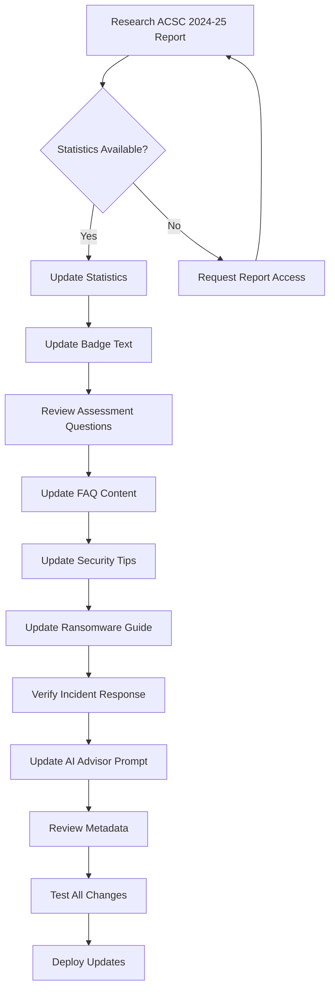

# ACSC Threat Report Update Plan: 2023-24 → 2024-25

## Overview

This plan outlines the work required to update the CyberSecGLM website from the ACSC Annual Cyber Threat Report 2023-24 to the 2024-25 edition.

## Current State Analysis

### Files Referencing ACSC/Threat Report

| File | Reference Type | Current Content |
|------|---------------|-----------------|
| [`app/page.tsx`](app/page.tsx:41) | Badge text | "Aligned to the ACSC Annual Cyber Threat Report 2023-24" |
| [`app/page.tsx`](app/page.tsx:97) | Card text | "ACSC Aligned" / "Essential Eight ready" |
| [`app/page.tsx`](app/page.tsx:118) | Statistic | "87,400+ Incidents reported in AU (FY24)" |
| [`app/layout.tsx`](app/layout.tsx:58) | Meta description | "aligned to ACSC best practice" |
| [`app/api/advisor/route.ts`](app/api/advisor/route.ts:53) | System prompt | References ACSC guidance |
| [`app/faq/page.tsx`](app/faq/page.tsx:63) | FAQ content | Essential Eight explanation |
| [`app/ransomware-guide/page.tsx`](app/ransomware-guide/page.tsx:100) | Contact info | ACSC contact: 1300 CYBER1 |
| [`app/incident-response/page.tsx`](app/incident-response/page.tsx:55) | Contact info | ACSC contact details |
| [`app/security-policy-template/page.tsx`](app/security-policy-template/page.tsx:512) | Links | ACSC Essential Eight reference |
| [`app/free-security-tools/page.tsx`](app/free-security-tools/page.tsx:162) | Tool reference | ACSC mitigation strategies |

### Assessment Categories (from [`data/questions.ts`](data/questions.ts))

The assessment covers 13 security areas:
1. Software Updates
2. User Authentication
3. Multi-Factor Authentication (MFA)
4. Backing Up Your Data
5. Cyber Security Training
6. Email Security
7. Network Security
8. Device Security
9. Data Protection
10. Access Control
11. Incident Response
12. Third-Party Risk
13. Physical Security

---

## Key Changes: ACSC 2023-24 → 2024-25

### Statistics Updates Required

> **Note:** These statistics need to be verified against the actual ACSC 2024-25 report when available.

| Metric | 2023-24 Report | 2024-25 Report |
|--------|---------------|-----------------|
| Total cyber incidents reported | 87,400+ | ~To be verified |
| Ransomware incidents | ~To be verified | ~To be verified |
| Business Email Compromise losses | ~To be verified | ~To be verified |
| Small business targeting % | ~To be verified | ~To be verified |
| **Avg. cost per cyber incident (small business)** | Not shown | **$56,600** ✅ |

### Emerging Threats to Consider

Based on ACSC threat report trends, the following areas may need attention:

1. **AI-Powered Attacks** - Increased use of AI for phishing and social engineering
2. **Supply Chain Attacks** - Growing targeting of third-party vendors
3. **Cloud Security** - Increased focus on cloud misconfigurations
4. **Critical Infrastructure** - Heightened threats to essential services
5. **Deepfakes** - Emerging threat for business impersonation

### Essential Eight Updates

The Essential Eight maturity model may have updates:
- New implementation guidance
- Revised maturity levels
- Updated prioritization

---

## Implementation Tasks

### Phase 1: Quick Wins (Badge & Text Updates) ✅ COMPLETED

#### 1.1 Update Homepage Badge
**File:** [`app/page.tsx`](app/page.tsx:41)
```tsx
// Updated ✅
<Badge variant="secondary" className="mb-4">
  Aligned to the ACSC Annual Cyber Threat Report 2024-25
</Badge>
```

#### 1.2 Update Statistics Section
**File:** [`app/page.tsx`](app/page.tsx:118)
```tsx
// Updated ✅
<div className="text-3xl font-bold text-primary">$56,600</div>
<p className="mt-1 text-sm text-muted-foreground">Avg. cost per cyber incident (small business)</p>
```

### Phase 2: Content Updates ✅ COMPLETED

#### 2.1 FAQ Updates
**File:** [`data/faq.ts`](data/faq.ts) ✅
- Added ACSC 2024-25 statistic ($56,600 average cost) to first FAQ

#### 2.2 Ransomware Guide Updates
**File:** [`app/ransomware-guide/page.tsx`](app/ransomware-guide/page.tsx) ✅
- Updated cost statistic from $49,000 to $56,600
- Added reference to ACSC Annual Cyber Threat Report 2024-25

#### 2.3 Incident Response Updates
**File:** [`app/incident-response/page.tsx`](app/incident-response/page.tsx) ✅
- ACSC contact information verified (1300 CYBER1 - 1300 292 371)
- Contact details are current and accurate

### Phase 3: AI Advisor Updates ✅ COMPLETED

#### 3.1 System Prompt Review
**File:** [`app/api/advisor/route.ts`](app/api/advisor/route.ts:45-68) ✅
- Added reference to ACSC Annual Cyber Threat Report 2024-25
- Added key context: $56,600 average cost per cyber incident
- Added context about common threats targeting small businesses

---

## Files to Modify Summary

| File | Changes Required |
|------|-----------------|
| `app/page.tsx` | Badge text, statistics |
| `data/questions.ts` | Question review, feedback updates |
| `data/faq.ts` | New FAQs, updated advice |
| `app/security-tips/page.tsx` | Updated tips |
| `app/ransomware-guide/page.tsx` | Statistics, variants |
| `app/incident-response/page.tsx` | Contact verification |
| `app/api/advisor/route.ts` | System prompt updates |
| `app/layout.tsx` | Meta description review |

---

## Research Required

Before implementation, the following information needs to be sourced from the ACSC 2024-25 Annual Cyber Threat Report:

1. **Total incident count** for FY25
2. **Ransomware incident statistics**
3. **Business Email Compromise statistics**
4. **Small business targeting trends**
5. **New or updated Essential Eight guidance**
6. **Emerging threat categories**
7. **Updated ACSC contact information** (if changed)

---

## Workflow Diagram



---

## Next Steps

1. **Obtain ACSC 2024-25 Report** - Access the official report for accurate statistics
2. **Extract Key Statistics** - Document all numerical updates needed
3. **Identify New Threats** - List any new categories or recommendations
4. **Begin Phase 1** - Start with quick wins (badge and text updates)
5. **Progress Through Phases** - Systematically update all content

---

## Questions for User

- [ ] Do you have access to the ACSC 2024-25 Annual Cyber Threat Report?
- [ ] Are there specific statistics or sections you want prioritized?
- [ ] Should we add new assessment categories for emerging threats?
- [ ] Do you want to update the AI advisor's knowledge base with new threat information?
