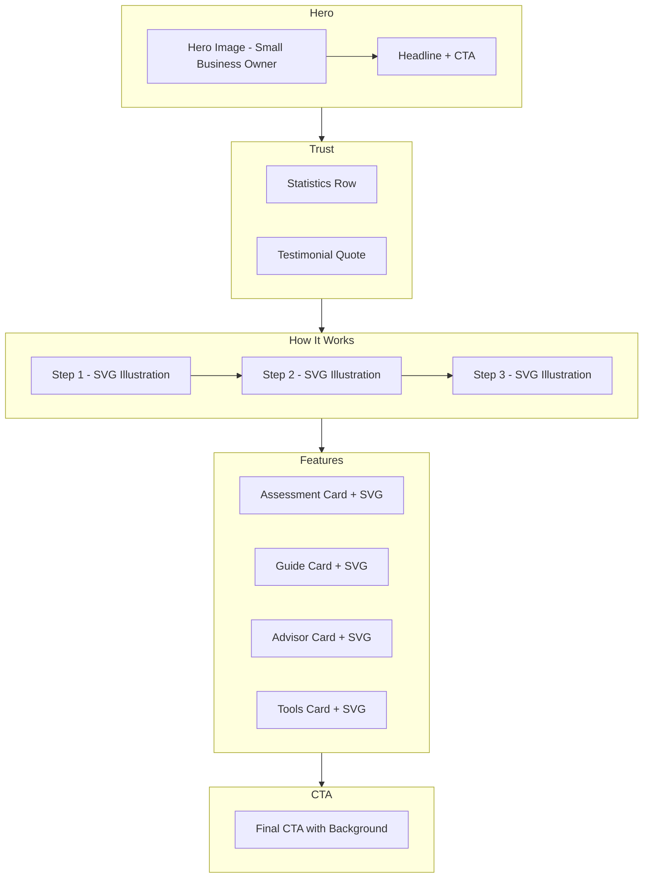

# Home Page Redesign Plan

## Executive Summary

The current home page is text-heavy, lacks visual imagery, and has a busy layout that overwhelms visitors. This redesign plan focuses on integrating images, creating better visual hierarchy, and making the page more inviting while maintaining the professional cybersecurity focus.

---

## Current Issues Analysis

### Problems Identified

1. **No Hero Image** - The hero section relies solely on text and a card, missing the opportunity to create an emotional connection
2. **Text-Heavy Layout** - Dense text blocks without visual breaks
3. **Repetitive Card Patterns** - Multiple sections use identical card layouts
4. **No Visual Hierarchy** - Everything competes for attention equally
5. **Missing Emotional Appeal** - Purely functional without warmth
6. **No Lifestyle/Context Images** - Abstract icons only, no human element

### Current Structure (7 sections)

```
1. Hero (text + card only)
2. How it works (3 cards)
3. Threat snapshot (3 stat cards)
4. Value props (4 cards)
5. Advisor CTA (text + card)
6. FAQ (accordion)
7. About (text only)
```

---

## Proposed Redesign

### Design Philosophy

- **Friendly & Approachable**: Small business owners in relaxed, warm settings
- **Less is More**: Reduce cognitive load with fewer, more impactful sections
- **Visual Storytelling**: Use images to convey trust, security, and ease
- **Clear Hierarchy**: Guide the eye from hero to action

### New Structure (5 sections)

```
1. Hero with Image (immersive, emotional)
2. Trust Indicators (streamlined social proof)
3. How It Works (visual step-by-step)
4. Key Features (illustrated cards)
5. CTA Section (simplified, focused)
```

---

## Section-by-Section Redesign

### 1. Hero Section - Complete Redesign

**Current State:**
- Text-only with gradient background
- Badge, heading, paragraph, 3 buttons, checkmarks, and a card
- Too many elements competing for attention

**Proposed Design:**

```
┌─────────────────────────────────────────────────────────────────┐
│                                                                 │
│   ┌─────────────────────┐  ┌─────────────────────────────────┐ │
│   │                     │  │                                 │ │
│   │   HERO IMAGE        │  │  Badge: ACSC Aligned            │ │
│   │   Small business    │  │                                 │ │
│   │   owner working     │  │  H1: Protect your business      │ │
│   │   peacefully on     │  │      without the complexity     │ │
│   │   laptop in         │  │                                 │ │
│   │   relaxed setting   │  │  Subtitle: 10-minute assessment │ │
│   │                     │  │  tailored for Australian SMBs   │ │
│   │                     │  │                                 │ │
│   │                     │  │  [Start Assessment] [Learn More]│ │
│   │                     │  │                                 │ │
│   │                     │  │  ✓ Free  ✓ Private  ✓ AU-focused│ │
│   │                     │  │                                 │ │
│   └─────────────────────┘  └─────────────────────────────────┘ │
│                                                                 │
└─────────────────────────────────────────────────────────────────┘
```

**Image Recommendations:**
- **Primary Hero Image**: Small business owner working on laptop in a cafe or home office setting
- **Style**: Warm lighting, natural environment, person looking relaxed/confident
- **Source**: Unsplash - search terms: "small business owner laptop", "entrepreneur working cafe", "business owner relaxed"

**Suggested Unsplash Images:**
1. `https://images.unsplash.com/photo-1556761175-5973dc0f32e7` - Business meeting in bright space
2. `https://images.unsplash.com/photo-1507003211169-0a1dd7228f2d` - Person working on laptop
3. `https://images.unsplash.com/photo-1542744173-8e7e53415bb0` - Team working together

**Implementation:**
```tsx
// Using Next.js Image component with Unsplash
<Image
  src="https://images.unsplash.com/photo-XXXXX?auto=format&fit=crop&w=1200&q=80"
  alt="Small business owner managing their cyber security with confidence"
  width={600}
  height={500}
  className="rounded-2xl shadow-2xl"
  priority
/>
```

---

### 2. Trust Indicators Section - NEW

**Purpose:** Replace the busy threat statistics with cleaner social proof

**Proposed Design:**

```
┌─────────────────────────────────────────────────────────────────┐
│                                                                 │
│   Trusted by Australian small businesses                        │
│                                                                 │
│   ┌─────────┐  ┌─────────┐  ┌─────────┐  ┌─────────┐          │
│   │  87K+   │  │  13     │  │  12min  │  │  4.8★   │          │
│   │incidents│  │ areas   │  │ average │  │ rating  │          │
│   │reported │  │assessed │  │  time   │  │         │          │
│   └─────────┘  └─────────┘  └─────────┘  └─────────┘          │
│                                                                 │
│   "This helped me understand exactly what to do" - Sarah, Cafe │
│                                                                 │
└─────────────────────────────────────────────────────────────────┘
```

**Key Changes:**
- Simplified statistics with icons
- Add a testimonial quote with photo
- Remove the source citation clutter

---

### 3. How It Works - Enhanced with Illustrations

**Current State:** 3 text cards with icons

**Proposed Design:**

```
┌─────────────────────────────────────────────────────────────────┐
│                                                                 │
│   How It Works                                                  │
│                                                                 │
│   ┌───────────────┐    ┌───────────────┐    ┌───────────────┐ │
│   │   [SVG ILLO]  │    │   [SVG ILLO]  │    │   [SVG ILLO]  │ │
│   │               │    │               │    │               │ │
│   │   Clipboard   │───▶│   Report      │───▶│   Shield      │ │
│   │   with check  │    │   with chart  │    │   protected   │ │
│   │               │    │               │    │               │ │
│   │  1. Answer    │    │  2. Get your  │    │  3. Take      │ │
│   │  questions    │    │  action plan  │    │  action       │ │
│   │               │    │               │    │               │ │
│   └───────────────┘    └───────────────┘    └───────────────┘ │
│                                                                 │
└─────────────────────────────────────────────────────────────────┘
```

**Custom SVG Illustrations:**
1. **Step 1**: Clipboard with checkmarks being filled out
2. **Step 2**: Document/report with chart showing score
3. **Step 3**: Shield with checkmark, protected business

---

### 4. Key Features - Illustrated Cards

**Current State:** 4 identical cards with Lucide icons

**Proposed Design:**

```
┌─────────────────────────────────────────────────────────────────┐
│                                                                 │
│   Everything you need to improve your security                  │
│                                                                 │
│   ┌─────────────────────┐  ┌─────────────────────┐            │
│   │ [SVG: Assessment]   │  │ [SVG: Guide Book]   │            │
│   │                     │  │                     │            │
│   │ Security Assessment │  │ Security Guide      │            │
│   │                     │  │                     │            │
│   │ Diagnose your       │  │ Step-by-step        │            │
│   │ current posture     │  │ guidance for your   │            │
│   │                     │  │ team                │            │
│   │ [Start Now →]       │  │ [Read Guide →]      │            │
│   └─────────────────────┘  └─────────────────────┘            │
│                                                                 │
│   ┌─────────────────────┐  ┌─────────────────────┐            │
│   │ [SVG: Chat Advisor] │  │ [SVG: Tools]        │            │
│   │                     │  │                     │            │
│   │ AI Security Advisor │  │ Free Tools          │            │
│   │                     │  │                     │            │
│   │ Ask questions and   │  │ Curated tools to    │            │
│   │ get instant answers │  │ improve protection  │            │
│   │                     │  │                     │            │
│   │ [Chat Now →]        │  │ [Browse Tools →]    │            │
│   └─────────────────────┘  └─────────────────────┘            │
│                                                                 │
└─────────────────────────────────────────────────────────────────┘
```

**Custom SVG Illustrations:**
1. **Assessment**: Magnifying glass over a checklist
2. **Guide**: Open book with security shield
3. **Advisor**: Chat bubble with shield icon
4. **Tools**: Toolbox with gear and shield

---

### 5. CTA Section - Simplified

**Current State:** Multiple CTAs scattered throughout, confusing user journey

**Proposed Design:**

```
┌─────────────────────────────────────────────────────────────────┐
│                                                                 │
│   ┌─────────────────────────────────────────────────────────┐  │
│   │                                                         │  │
│   │   [Background Image: Abstract security pattern]         │  │
│   │                                                         │  │
│   │   Ready to secure your business?                        │  │
│   │                                                         │  │
│   │   Take the free 10-minute assessment and get your       │  │
│   │   personalised action plan today.                       │  │
│   │                                                         │  │
│   │   [Start Free Assessment]                               │  │
│   │                                                         │  │
│   │   No sign-up required • 100% private                    │  │
│   │                                                         │  │
│   └─────────────────────────────────────────────────────────┘  │
│                                                                 │
└─────────────────────────────────────────────────────────────────┘
```

---

## Visual Hierarchy Improvements

### Typography Scale

```
Hero Title:     48-64px (text-5xl / text-6xl)
Section Title:  30-36px (text-3xl)
Card Title:     18-20px (text-lg)
Body Text:      14-16px (text-sm / text-base)
Caption:        12-14px (text-xs / text-sm)
```

### Spacing System

```
Section Padding:    py-20 lg:py-24 (80-96px)
Card Padding:       p-6 lg:p-8 (24-32px)
Element Gap:        gap-6 lg:gap-8 (24-32px)
Text Spacing:       space-y-3 lg:space-y-4 (12-16px)
```

### Color Usage

```
Primary (Teal):     CTAs, icons, highlights
Accent (Orange):    Badges, emphasis, hover states
Background:         Warm cream (#F8F5F0)
Cards:              White with subtle shadows
Text:               Dark slate for readability
```

---

## Image Asset Recommendations

### Hero Images (Unsplash - Free)

| Purpose | Search Terms | Style Notes |
|---------|--------------|-------------|
| Primary Hero | "small business owner laptop cafe" | Warm, natural light |
| Alternative 1 | "entrepreneur working relaxed" | Diverse representation |
| Alternative 2 | "business owner smiling computer" | Confident, approachable |

### SVG Illustrations (Custom)

| Section | Illustration | Description |
|---------|--------------|-------------|
| How It Works - Step 1 | Clipboard checklist | Person filling security checklist |
| How It Works - Step 2 | Report document | Document with score visualization |
| How It Works - Step 3 | Protected shield | Shield with checkmark, secure |
| Features - Assessment | Magnifying glass | Over checklist, diagnostic feel |
| Features - Guide | Book with shield | Open book, educational |
| Features - Advisor | Chat bubble | Friendly AI assistant feel |
| Features - Tools | Toolbox | Practical, actionable |

---

## Implementation Guidelines

### Phase 1: Hero Section
1. Add hero image with proper Next.js Image optimization
2. Simplify CTA buttons to 2 primary actions
3. Add subtle animation on scroll

### Phase 2: Trust Indicators
1. Create streamlined stats section
2. Add testimonial with optional photo
3. Include subtle trust badges

### Phase 3: Feature Illustrations
1. Create or source custom SVG illustrations
2. Implement in feature cards
3. Add hover animations

### Phase 4: CTA Consolidation
1. Remove redundant CTAs throughout
2. Create focused final CTA section
3. Add background pattern/image

### Technical Considerations

```tsx
// Next.js Image optimization for Unsplash
<Image
  src="https://images.unsplash.com/photo-XXX"
  alt="Description"
  width={600}
  height={400}
  className="object-cover"
  loading="lazy" // for below-fold images
  priority // for hero image
/>

// SVG as React components for illustrations
// Place in /components/illustrations/
```

---

## Wireframe Overview



---

## Removed/Consolidated Sections

| Original Section | Action | Reason |
|------------------|--------|--------|
| Threat Snapshot | Consolidate into Trust | Statistics without context are scary, not helpful |
| Advisor CTA | Merge into Features | Redundant with feature card |
| FAQ | Move to dedicated page | Reduces clutter, still accessible via nav |
| About | Move to footer/dedicated page | Not primary conversion focus |

---

## Success Metrics

After implementation, measure:
- **Bounce Rate**: Should decrease with more engaging hero
- **Time on Page**: Should increase with visual content
- **Conversion Rate**: Should improve with clearer CTAs
- **Scroll Depth**: Should improve with better hierarchy

---

## Next Steps

1. Review and approve this plan
2. Switch to Code mode for implementation
3. Source and optimize images
4. Create custom SVG illustrations
5. Implement responsive design
6. Test and iterate
