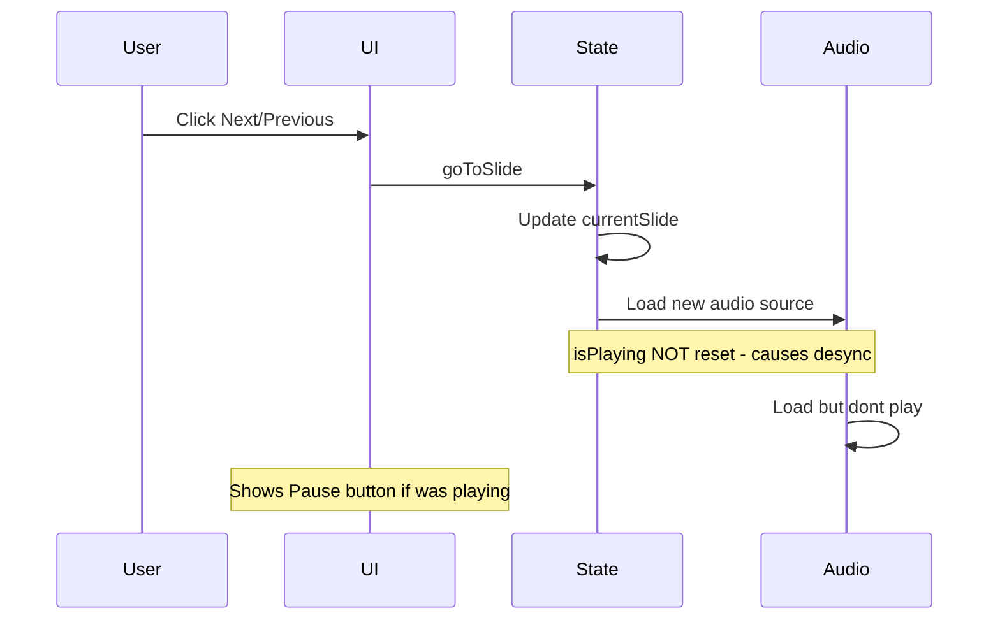
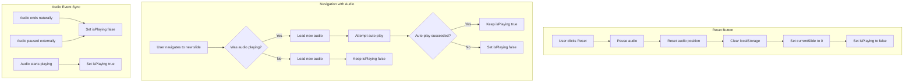

# Training Page Audio and Reset Button Fix Plan

## Problem Summary

The user reported three issues with the training page:

1. **No Reset Button** - When refreshing the page, users are taken back to their saved slide position (slide 2+), with no way to return to slide 1
2. **Audio Doesn't Auto-start** - Audio requires manual Play button press to start
3. **Audio State Desync** - When navigating slides while audio is playing, the Pause button shows but audio stops

## Current Implementation Analysis

### Relevant Code Locations

| Component | File | Lines |
|-----------|------|-------|
| State initialization | [`app/training/page.tsx`](app/training/page.tsx:92) | 92-97 |
| Progress loading | [`app/training/page.tsx`](app/training/page.tsx:102) | 102-121 |
| Audio handling | [`app/training/page.tsx`](app/training/page.tsx:170) | 170-176 |
| goToSlide function | [`app/training/page.tsx`](app/training/page.tsx:178) | 178-183 |
| togglePlay function | [`app/training/page.tsx`](app/training/page.tsx:204) | 204-219 |
| restartTraining function | [`app/training/page.tsx`](app/training/page.tsx:221) | 221-229 |
| Navigation controls | [`app/training/page.tsx`](app/training/page.tsx:754) | 754-820 |

### Current Behavior



## Proposed Solution

### 1. Add Reset Button

Add a Reset button to the navigation controls area using the already-imported `RotateCcw` icon.

**Location**: In the center controls section, next to the Notes button

**Code Change**:
```tsx
<Button
  variant="ghost"
  size="sm"
  onClick={restartTraining}
  className="gap-1"
  title="Reset to first slide"
>
  <RotateCcw className="h-4 w-4" />
  Reset
</Button>
```

### 2. Fix Audio Auto-play on Navigation

Modify the audio handling to continue playing if audio was already playing.

**Current Code** (lines 170-176):
```tsx
useEffect(() => {
  const currentSlideData = trainingSlides[state.currentSlide];
  if (audioRef.current && currentSlideData.audioPath) {
    audioRef.current.src = currentSlideData.audioPath;
    audioRef.current.load();
  }
}, [state.currentSlide]);
```

**Updated Code**:
```tsx
useEffect(() => {
  const currentSlideData = trainingSlides[state.currentSlide];
  if (audioRef.current && currentSlideData.audioPath) {
    audioRef.current.src = currentSlideData.audioPath;
    audioRef.current.load();
    
    // Auto-play if was already playing
    if (state.isPlaying) {
      audioRef.current.play().catch(() => {
        // Auto-play blocked, reset state
        setState(prev => ({ ...prev, isPlaying: false }));
      });
    }
  }
}, [state.currentSlide]);
```

### 3. Add Audio Event Listeners

Add event listeners to synchronize UI state with actual audio playback state.

**New useEffect** to add after the existing audio useEffect:
```tsx
// Sync isPlaying state with actual audio events
useEffect(() => {
  const audio = audioRef.current;
  if (!audio) return;

  const handleEnded = () => {
    setState(prev => ({ ...prev, isPlaying: false }));
  };

  const handlePause = () => {
    setState(prev => ({ ...prev, isPlaying: false }));
  };

  const handlePlay = () => {
    setState(prev => ({ ...prev, isPlaying: true }));
  };

  audio.addEventListener('ended', handleEnded);
  audio.addEventListener('pause', handlePause);
  audio.addEventListener('play', handlePlay);

  return () => {
    audio.removeEventListener('ended', handleEnded);
    audio.removeEventListener('pause', handlePause);
    audio.removeEventListener('play', handlePlay);
  };
}, []);
```

### 4. Update restartTraining Function

Ensure the restart function also stops any playing audio:

**Current Code** (lines 221-229):
```tsx
const restartTraining = useCallback(() => {
  localStorage.removeItem(TRAINING_STORAGE_KEY);
  setState({
    currentSlide: 0,
    showPresenterNotes: false,
    isPlaying: false,
    isCompleted: false,
  });
}, []);
```

**Updated Code**:
```tsx
const restartTraining = useCallback(() => {
  // Stop any playing audio
  if (audioRef.current) {
    audioRef.current.pause();
    audioRef.current.currentTime = 0;
  }
  
  localStorage.removeItem(TRAINING_STORAGE_KEY);
  setState({
    currentSlide: 0,
    showPresenterNotes: false,
    isPlaying: false,
    isCompleted: false,
  });
}, []);
```

## Implementation Flow



## Files to Modify

| File | Changes |
|------|---------|
| [`app/training/page.tsx`](app/training/page.tsx) | All changes in this file |

## Testing Checklist

- [ ] Reset button appears in navigation controls
- [ ] Reset button returns to slide 1
- [ ] Reset button clears saved progress from localStorage
- [ ] Reset button stops any playing audio
- [ ] Audio auto-plays when navigating if it was playing
- [ ] Audio stays paused when navigating if it was paused
- [ ] Play/Pause button correctly reflects actual audio state
- [ ] Audio state syncs when audio ends naturally
- [ ] Page refresh returns to saved slide position
