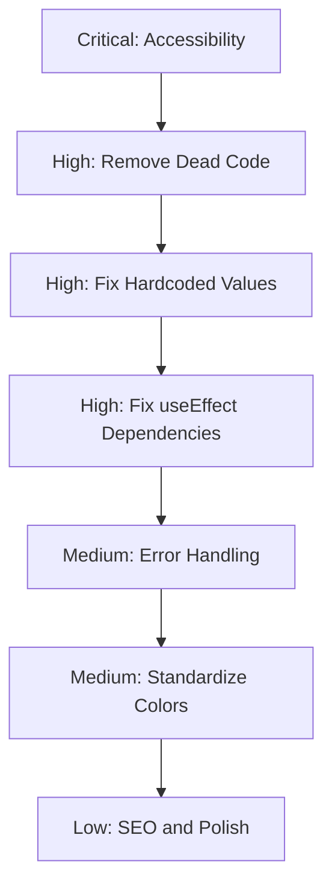

# Training Page Production Review

**Date:** February 19, 2026  
**File:** [`app/training/page.tsx`](app/training/page.tsx)  
**Related Files:** [`types/training.ts`](types/training.ts), [`data/training-slides.ts`](data/training-slides.ts)  
**Status:** Pre-Production Review

---

## Executive Summary

This review identified **15 issues** across the training page that should be addressed before production deployment:

| Severity | Count | Categories |
|----------|-------|------------|
| 🔴 Critical | 1 | Accessibility |
| 🟠 High | 4 | Code Quality, Performance |
| 🟡 Medium | 6 | Code Organization, Type Safety |
| 🟢 Low | 4 | Unused Code, Minor Improvements |

---

## 🔴 Critical Issues

### 1. Missing Accessibility Features

**Location:** Throughout component  
**Issue:** The training page lacks essential accessibility features required for production:

- No `aria-live` regions for slide content changes
- No focus management when slides change
- Audio element lacks proper `aria-label`
- No skip navigation for keyboard users
- Dynamic content changes are not announced to screen readers

**Impact:** WCAG 2.1 Level AA compliance failure, potential legal issues

**Recommendation:**
```tsx
// Add aria-live region for slide content
<div aria-live="polite" aria-atomic="true" className="flex-1 relative overflow-hidden">
  {renderSlideContent(currentSlideData)}
</div>

// Add aria-label to audio element
<audio ref={audioRef} className="hidden" aria-label="Training narration audio" />

// Add visually hidden slide counter for screen readers
<span className="sr-only">
  Slide {state.currentSlide + 1} of {totalSlides}
</span>
```

---

## 🟠 High Priority Issues

### 2. Unused Imports

**Location:** Lines 13-14  
**Issue:** `Volume2` and `VolumeX` icons are imported but never used in the component.

```tsx
// These imports are unused:
import {
  // ...
  Volume2,      // ❌ Not used
  VolumeX,      // ❌ Not used
  // ...
} from "lucide-react";
```

**Recommendation:** Remove unused imports to reduce bundle size.

---

### 3. Unused Helper Functions

**Location:** Lines 78-89  
**Issue:** Two helper functions are defined but never called:

```tsx
// ❌ Never called
function getBackgroundClass(slide: TrainingSlide): string {
  if (slide.background === 'navy') {
    return 'bg-[#0D1B2A]';
  }
  return 'bg-[#F4F8FB]';
}

// ❌ Never called - also has a Tailwind issue
function getAccentBarClass(color: string): string {
  const colorHex = colorValues[color as keyof typeof colorValues] || colorValues.teal;
  return `bg-[${colorHex}]`;  // This won't work with Tailwind JIT
}
```

**Impact:** Dead code increases bundle size and reduces maintainability

**Recommendation:** Remove these functions or implement them properly if needed.

---

### 4. Hardcoded Slide Numbers in Footers

**Location:** Multiple render functions  
**Issue:** Slide numbers are hardcoded in footer sections instead of using dynamic values:

| Location | Hardcoded Value | Should Be |
|----------|-----------------|-----------|
| Line 357 | `2 / 12` | `{slide.id} / {totalSlides}` |
| Line 410 | `3 / 12` | `{slide.id} / {totalSlides}` |
| Line 472 | `{slide.id} / 12` | `{slide.id} / {totalSlides}` |
| Line 605 | `7 / 12` | `{slide.id} / {totalSlides}` |
| Line 649 | `8 / 12` | `{slide.id} / {totalSlides}` |
| Line 686 | `11 / 12` | `{slide.id} / {totalSlides}` |

**Impact:** If slides are added/removed, these numbers will be incorrect

**Recommendation:** Replace all hardcoded values with dynamic references:
```tsx
<span className="text-xs text-[#02C39A]">{slide.id} / {totalSlides}</span>
```

---

### 5. useEffect Dependency Array Issues

**Location:** Lines 137-167  
**Issue:** The keyboard navigation `useEffect` has incomplete dependencies:

```tsx
useEffect(() => {
  const handleKeyDown = (e: KeyboardEvent) => {
    // Uses goToSlide and togglePlay but they're not in dependencies
    switch (e.key) {
      case "ArrowLeft":
        goToSlide(state.currentSlide - 1);  // ❌ Not in deps
        break;
      case " ":
        togglePlay();  // ❌ Not in deps
        break;
      // ...
    }
  };
  // ...
}, [state.currentSlide]);  // Missing: goToSlide, togglePlay
```

**Impact:** Stale closure bugs, React strict mode warnings

**Recommendation:** Add missing dependencies or use `useCallback` refs:
```tsx
}, [state.currentSlide, goToSlide, togglePlay]);
```

---

## 🟡 Medium Priority Issues

### 6. Component Size and Organization

**Location:** Entire file (875 lines)  
**Issue:** The component is too large and handles too many responsibilities:
- State management
- Audio playback
- Keyboard navigation
- LocalStorage persistence
- 9 different slide renderers

**Impact:** Difficult to maintain, test, and reuse

**Recommendation:** Extract slide renderers into separate components:

```
components/training/
├── slides/
│   ├── TitleSlide.tsx
│   ├── StatsSlide.tsx
│   ├── ThreatsSlide.tsx
│   ├── TwoColumnSlide.tsx
│   ├── StepsSlide.tsx
│   ├── UpdatesSlide.tsx
│   ├── BackupSlide.tsx
│   ├── GridSlide.tsx
│   └── ChecklistSlide.tsx
├── TrainingNavigation.tsx
├── TrainingAudio.tsx
└── index.ts
```

---

### 7. Unused Type Properties

**Location:** [`types/training.ts`](types/training.ts:97-109)  
**Issue:** `UpdatesSlide` interface defines properties that are not used in rendering:

```tsx
export interface UpdatesSlide extends BaseSlide {
  // ...
  leftCardAccentColor: ColorToken;   // ❌ Not used in render
  rightCardAccentColor: ColorToken;  // ❌ Not used in render
  // ...
}
```

The render function uses hardcoded colors instead:
```tsx
// Line 554 - hardcoded #028090 instead of using leftCardAccentColor
<div className="h-[6px] bg-[#028090]" />

// Line 581 - hardcoded #F4A261 instead of using rightCardAccentColor  
<div className="h-[6px] bg-[#F4A261]" />
```

**Recommendation:** Either use the properties or remove them from the type definition.

---

### 8. Inconsistent Color Application

**Location:** Throughout slide renderers  
**Issue:** Mixed approaches for applying colors:

```tsx
// Some use colorValues object (correct):
<div className="h-[6px]" style={{ backgroundColor: colorValues[card.accentColor] }} />

// Others use hardcoded hex values (inconsistent):
<div className="h-[6px] bg-[#028090]" />
<div className="h-[6px] bg-[#F4A261]" />
```

**Impact:** Inconsistent with design system, harder to maintain

**Recommendation:** Standardize on using `colorValues` mapping throughout.

---

### 9. LocalStorage Error Handling

**Location:** Lines 102-121, 124-134  
**Issue:** LocalStorage operations lack comprehensive error handling:

```tsx
useEffect(() => {
  const savedProgress = localStorage.getItem(TRAINING_STORAGE_KEY);
  if (savedProgress) {
    try {
      // Only catches JSON parse errors
      const parsed = JSON.parse(savedProgress);
      // ...
    } catch (e) {
      console.error("Failed to parse saved progress:", e);
    }
  }
  // ❌ No try-catch for localStorage.setItem
}, []);
```

**Impact:** Can crash in private browsing mode or when storage quota is exceeded

**Recommendation:** Wrap all localStorage operations in try-catch:
```tsx
const saveProgress = useCallback((state: TrainingState) => {
  try {
    localStorage.setItem(TRAINING_STORAGE_KEY, JSON.stringify(state));
  } catch (e) {
    if (e instanceof DOMException && e.name === 'QuotaExceededError') {
      console.warn('localStorage quota exceeded');
    }
  }
}, []);
```

---

### 10. Missing Error Boundary

**Location:** N/A - Missing  
**Issue:** No error boundary wraps the training page content

**Impact:** If rendering fails, the entire app may crash instead of showing a fallback

**Recommendation:** Add an error boundary:
```tsx
// components/training/TrainingErrorBoundary.tsx
export class TrainingErrorBoundary extends React.Component {
  // ... error boundary implementation
}
```

---

### 11. Audio Loading Error Handling

**Location:** Lines 170-184  
**Issue:** Audio errors are silently caught without user feedback:

```tsx
audioRef.current.play().catch(() => {
  // Auto-play blocked, reset state
  setState(prev => ({ ...prev, isPlaying: false }));
});
```

**Impact:** Users don't know why audio isn't playing

**Recommendation:** Show a toast notification when audio fails:
```tsx
audioRef.current.play().catch((error) => {
  setState(prev => ({ ...prev, isPlaying: false }));
  toast({
    title: "Audio playback blocked",
    description: "Click the play button to start audio",
    variant: "default",
  });
});
```

---

## 🟢 Low Priority Issues

### 12. Missing SEO Metadata

**Location:** N/A - Missing  
**Issue:** No metadata export for the training page

**Impact:** Poor SEO, missing Open Graph tags

**Recommendation:** Create a separate server component for metadata or use `generateMetadata`:
```tsx
// app/training/layout.tsx
export const metadata: Metadata = {
  title: 'Cybersecurity Training | CyberSecTools',
  description: 'Interactive cybersecurity awareness training for small businesses',
};
```

---

### 13. Magic Numbers

**Location:** Various  
**Issue:** Several magic numbers without clear meaning:

```tsx
// Line 272 - What is 180?
<div className="relative h-full min-h-[calc(100vh-180px)] flex bg-[#0D1B2A]">

// Line 309 - What is 38?
<div className="absolute bottom-0 left-0 right-0 h-[38px] bg-[#0A1520]">
```

**Recommendation:** Extract to named constants:
```tsx
const HEADER_HEIGHT = 180;
const FOOTER_HEIGHT = 38;
```

---

### 14. Console Error in Production

**Location:** Line 117  
**Issue:** `console.error` call will appear in production builds

```tsx
console.error("Failed to parse saved progress:", e);
```

**Recommendation:** Use a proper logging utility or remove for production.

---

### 15. Missing TypeScript Strict Checks

**Location:** Various  
**Issue:** Some type assertions could be stricter:

```tsx
// Line 87 - Type assertion without validation
const colorHex = colorValues[color as keyof typeof colorValues] || colorValues.teal;
```

**Recommendation:** Create a type-safe helper function:
```tsx
function getColorValue(color: string): string {
  return color in colorValues 
    ? colorValues[color as ColorToken] 
    : colorValues.teal;
}
```

---

## Recommendations Summary

### Must Fix Before Production
1. ✅ Add accessibility features (aria-live, focus management)
2. ✅ Remove unused imports and functions
3. ✅ Fix hardcoded slide numbers
4. ✅ Fix useEffect dependency warnings

### Should Fix Before Production
5. ✅ Add error boundary
6. ✅ Improve error handling (localStorage, audio)
7. ✅ Standardize color application
8. ✅ Fix unused type properties

### Nice to Have
9. ⚪ Refactor into smaller components
10. ⚪ Add SEO metadata
11. ⚪ Extract magic numbers to constants
12. ⚪ Replace console.error with proper logging

---

## Proposed Implementation Order



---

## Files to Modify

| File | Changes Required |
|------|------------------|
| [`app/training/page.tsx`](app/training/page.tsx) | Major refactoring |
| [`types/training.ts`](types/training.ts) | Remove unused properties |
| [`data/training-slides.ts`](data/training-slides.ts) | Verify slide data consistency |

## New Files to Create

| File | Purpose |
|------|---------|
| `components/training/TrainingErrorBoundary.tsx` | Error handling |
| `app/training/layout.tsx` | SEO metadata |

---

## Next Steps

1. Review this analysis and confirm which issues to address
2. Switch to Code mode to implement fixes
3. Run lint and build to verify no regressions
4. Test accessibility with screen reader
5. Deploy to staging for final review
