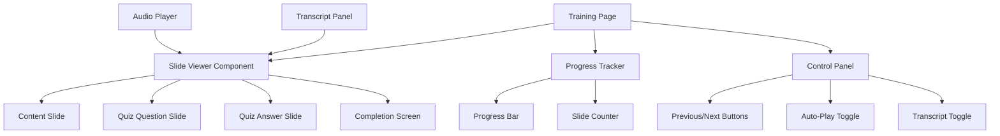
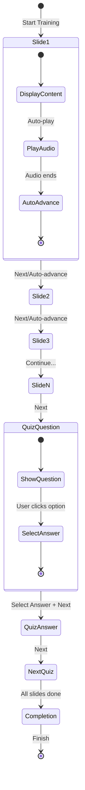

# Cybersecurity Training Presentation Implementation Plan

## Overview

This plan outlines the implementation of a new **Security Training Presentation** page for the CyberSecTools website. The page will provide an interactive, slide-based cybersecurity awareness training module for Australian small businesses.

### Key Requirements (Clarified)
- **No quiz scoring** - Quiz is purely educational, not assessed
- **Progress persistence** - Save progress to localStorage for resume capability
- **Audio placeholder** - Structure ready for future audio files

---

## Architecture Summary



---

## File Structure

```
app/
  training/
    page.tsx                 # Main training presentation page

components/
  training/
    slide-viewer.tsx         # Core slide display component
    slide-controls.tsx       # Navigation and control buttons
    transcript-panel.tsx      # Expandable transcript section
    quiz-question.tsx        # Quiz question display component
    quiz-answer.tsx          # Quiz answer reveal component
    completion-screen.tsx    # Training completion screen
    audio-player.tsx         # Audio player with auto-advance

data/
  training-slides.ts         # All slide content data

types/
  training.ts                # TypeScript interfaces for training
```

---

## TypeScript Interfaces

### Core Types

```typescript
// types/training.ts

export type SlideType = 'content' | 'quiz-question' | 'quiz-answer' | 'completion';

export interface TrainingSlide {
  id: number;
  type: SlideType;
  title: string;
  content: string[];           // Bullet points for content slides
  transcript: string;          // Full narrator text
  audioPath?: string;          // Path to MP3 file - optional for future
}

export interface QuizSlide extends TrainingSlide {
  type: 'quiz-question';
  question: string;
  options: QuizOption[];
}

export interface QuizOption {
  id: string;                  // A, B, C, D
  text: string;
}

export interface QuizAnswerSlide extends TrainingSlide {
  type: 'quiz-answer';
  correctAnswer: string;       // A, B, C, or D
  explanation: string;
  questionId: number;          // Reference to the question slide
}

export interface TrainingState {
  currentSlide: number;
  showTranscript: boolean;
  autoAdvance: boolean;
  quizAnswers: Record<number, string>;
  isCompleted: boolean;
}
```

---

## Slide Content Structure

### Slides Overview (26 Slides + Completion)

| Slide # | Type | Title |
|---------|------|-------|
| 1 | content | Cybersecurity for Australian Small Business |
| 2 | content | Why Cybersecurity Matters |
| 3 | content | The Most Common Compromise Methods |
| 4 | content | Phishing - The #1 Entry Point |
| 5 | content | Business Email Compromise |
| 6 | content | Ransomware |
| 7 | content | Stolen Passwords & MFA Fatigue |
| 8 | content | Unpatched Software |
| 9 | content | What is the Essential Eight |
| 10 | content | Keep Systems Updated |
| 11 | content | Only Use Approved Software |
| 12 | content | Use Multi-Factor Authentication |
| 13 | content | Backups Protect the Business |
| 14 | content | Limit Administrative Privileges |
| 15 | content | Warning Signs of an Incident |
| 16 | content | What To Do Immediately |
| 17 | quiz-question | Question 1 - Bank Details Change |
| 18 | quiz-answer | Answer 1 - Bank Details Change |
| 19 | quiz-question | Question 2 - Unexpected MFA Prompt |
| 20 | quiz-answer | Answer 2 - Unexpected MFA Prompt |
| 21 | quiz-question | Question 3 - Suspicious Attachment |
| 22 | quiz-answer | Answer 3 - Suspicious Attachment |
| 23 | quiz-question | Question 4 - Delaying Updates |
| 24 | quiz-answer | Answer 4 - Delaying Updates |
| 25 | quiz-question | Question 5 - Ransomware Recovery |
| 26 | quiz-answer | Answer 5 - Ransomware Recovery |
| 27 | completion | Training Complete |

---

## Component Specifications

### 1. Main Page Component - [`page.tsx`](app/training/page.tsx)

**Responsibilities:**
- Manage training state with useState
- Handle keyboard navigation
- Render slide viewer and controls
- Track completion status

**State Management:**
```typescript
const [state, setState] = useState<TrainingState>({
  currentSlide: 0,
  showTranscript: false,
  autoAdvance: false,
  quizAnswers: {},
  isCompleted: false
});
```

### 2. Slide Viewer Component - [`slide-viewer.tsx`](components/training/slide-viewer.tsx)

**Props:**
- `slide: TrainingSlide`
- `showTranscript: boolean`
- `onAnswerSelect?: (answerId: string) => void`
- `selectedAnswer?: string`

**Features:**
- Render different slide types
- Display bullet points with proper styling
- Show transcript when toggled
- Handle quiz option selection

### 3. Slide Controls Component - [`slide-controls.tsx`](components/training/slide-controls.tsx)

**Props:**
- `currentSlide: number`
- `totalSlides: number`
- `onPrevious: () => void`
- `onNext: () => void`
- `autoAdvance: boolean`
- `onAutoAdvanceToggle: () => void`
- `canGoPrevious: boolean`
- `canGoNext: boolean`

**Features:**
- Previous/Next navigation buttons
- Auto-advance toggle switch
- Keyboard shortcut hints

### 4. Transcript Panel Component - [`transcript-panel.tsx`](components/training/transcript-panel.tsx)

**Props:**
- `transcript: string`
- `isVisible: boolean`

**Accessibility:**
- Uses `aria-live="polite"` for screen readers
- Animated expand/collapse
- High contrast text option

### 5. Audio Player Component - [`audio-player.tsx`](components/training/audio-player.tsx)

**Props:**
- `audioPath?: string`
- `autoAdvance: boolean`
- `onAudioEnd: () => void`
- `isPlaying: boolean`

**Features:**
- Hidden audio element for background playback
- Auto-advance trigger when audio ends
- Graceful fallback when no audio file exists

### 6. Completion Screen Component - [`completion-screen.tsx`](components/training/completion-screen.tsx)

**Features:**
- Congratulations message
- Summary of quiz performance
- Option to restart training
- Link to additional resources

---

## User Interaction Flow



---

## Accessibility Requirements

1. **Keyboard Navigation:**
   - Arrow keys: Previous/Next slide
   - Space: Toggle auto-play
   - T: Toggle transcript
   - Tab: Navigate through quiz options

2. **Screen Reader Support:**
   - `aria-live="polite"` for transcript updates
   - Proper heading hierarchy
   - Descriptive button labels
   - Progress announcements

3. **Visual Accessibility:**
   - High contrast mode support
   - Focus indicators on all interactive elements
   - Sufficient color contrast ratios
   - Scalable text

---

## Audio Implementation Strategy

Since audio files are not yet available, the implementation will:

1. **Include audio element structure** with placeholder paths
2. **Gracefully handle missing audio** - no errors when files don't exist
3. **Provide visual indicator** that audio will be added
4. **Allow auto-advance toggle** to work independently of audio

```typescript
// Audio handling with fallback
const handleAudioError = () => {
  // Silently handle missing audio
  console.log('Audio not available for this slide');
};

// Auto-advance works with or without audio
useEffect(() => {
  if (autoAdvance && !audioAvailable) {
    // Set a default timing for auto-advance
    const timer = setTimeout(goToNextSlide, 10000);
    return () => clearTimeout(timer);
  }
}, [autoAdvance, currentSlide]);
```

---

## Styling Approach

Following existing project patterns:

- **Tailwind CSS** for all styling
- **shadcn/ui components** for buttons, cards, progress bars
- **Consistent with existing pages** - similar layout to assessment page
- **Dark mode support** via theme provider

### Key Style Patterns:

```tsx
// Slide container
<div className="max-w-4xl mx-auto p-6">
  <Card className="p-8">
    {/* Slide content */}
  </Card>
</div>

// Progress bar
<Progress value={progress} className="h-2" />

// Navigation buttons
<div className="flex justify-between mt-6">
  <Button variant="outline" onClick={onPrevious}>
    Previous
  </Button>
  <Button onClick={onNext}>
    Next
  </Button>
</div>
```

---

## Implementation Steps

### Phase 1: Foundation
1. Create TypeScript types in [`types/training.ts`](types/training.ts)
2. Create slide data file in [`data/training-slides.ts`](data/training-slides.ts)
3. Create basic page structure in [`app/training/page.tsx`](app/training/page.tsx)

### Phase 2: Core Components
4. Create slide viewer component
5. Create slide controls component
6. Create transcript panel component

### Phase 3: Quiz Functionality
7. Create quiz question component
8. Create quiz answer component
9. Implement answer selection and tracking

### Phase 4: Polish
10. Create completion screen component
11. Add keyboard navigation
12. Add audio player placeholder
13. Update sitemap.xml

---

## Testing Checklist

- [ ] All 27 slides render correctly
- [ ] Navigation works with buttons and keyboard
- [ ] Progress bar updates accurately
- [ ] Transcript toggle works and is accessible
- [ ] Auto-advance toggle functions correctly
- [ ] Quiz questions accept and store answers
- [ ] Quiz answers display correct option with explanation
- [ ] Completion screen shows after final slide
- [ ] Page is responsive on mobile devices
- [ ] Dark mode works correctly
- [ ] Screen reader navigation works
- [ ] No console errors when audio files are missing

---

## Dependencies

All required dependencies are already installed:
- `react` - State management
- `lucide-react` - Icons
- `@/components/ui/*` - UI components
- `tailwindcss` - Styling

No new dependencies required.

---

## Estimated File Sizes

| File | Estimated Size |
|------|----------------|
| [`types/training.ts`](types/training.ts) | ~500 bytes |
| [`data/training-slides.ts`](data/training-slides.ts) | ~15 KB |
| [`app/training/page.tsx`](app/training/page.tsx) | ~8 KB |
| [`components/training/*.tsx`](components/training/) | ~12 KB total |

---

## Confirmed Requirements

1. **Quiz Scoring:** No scoring - quiz is purely educational
2. **Progress Persistence:** Save progress to localStorage for resume capability
3. **Certificate:** Not required for initial implementation
4. **Audio:** Placeholder structure for future audio files

---

## Next Steps

Once this plan is approved, switch to **Code mode** to implement:
1. Create the TypeScript types
2. Create the slide data file with all content
3. Build the page and components
4. Add to sitemap