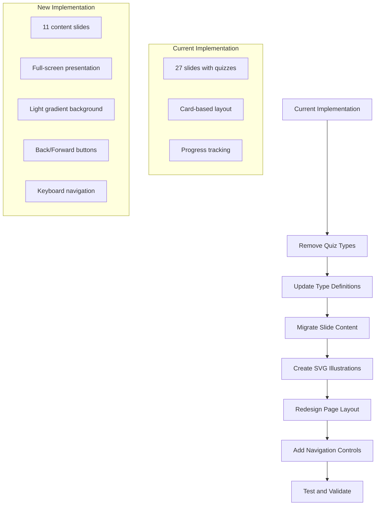

# Training Slide Presentation Redesign Plan

## Overview

This plan outlines the redesign of the training slide presentation system to create a professional, full-screen presentation experience based on the new slide content in `Training-slide-information.md`.

## Current State Analysis

### Existing Implementation
- **Location**: [`app/training/page.tsx`](app/training/page.tsx)
- **Data**: [`data/training-slides.ts`](data/training-slides.ts) - 27 slides including quizzes
- **Types**: [`types/training.ts`](types/training.ts) - Supports content, quiz-question, quiz-answer, completion types
- **Features**: Progress tracking, audio support, transcript toggle, keyboard navigation

### New Content
- **Source**: [`plans/Training-slide-information.md`](plans/Training-slide-information.md)
- **Slides**: 11 content slides with presenter scripts
- **Focus**: ACSC guidance for Australian small businesses

## Requirements Summary

| Requirement | Details |
|-------------|---------|
| Quiz removal | Remove all quiz functionality |
| Audio support | Keep infrastructure for future audio files |
| Background | Light colored, mostly solid with subtle gradient |
| Layout | Full-screen slides with header on top |
| Navigation | Backwards and forwards buttons |
| Visuals | Professional images and custom SVGs |

---

## Implementation Plan

### Phase 1: Type Definitions Update

**File**: [`types/training.ts`](types/training.ts)

#### Changes:
1. Remove quiz-related types: `QuizQuestionSlide`, `QuizAnswerSlide`, `QuizOption`
2. Simplify `SlideType` to: `'content' | 'title' | 'completion'`
3. Add new fields to `ContentSlide`:
   - `presenterScript?: string` - For presenter notes
   - `imageUri?: string` - For Unsplash/images
   - `illustration?: string` - For custom SVG component name
   - `bulletPoints: string[]` - For slide content

#### New Type Structure:

```typescript
export type SlideType = 'title' | 'content' | 'completion';

export interface BaseSlide {
  id: number;
  type: SlideType;
  title: string;
  transcript?: string;
  audioPath?: string;
}

export interface TitleSlide extends BaseSlide {
  type: 'title';
  subtitle: string;
  businessName: string;
  date: string;
}

export interface ContentSlide extends BaseSlide {
  type: 'content';
  bulletPoints: string[];
  presenterScript?: string;
  imageUri?: string;
  illustration?: SlideIllustration;
}

export interface CompletionSlide extends BaseSlide {
  type: 'completion';
  message: string;
  resources: string[];
}

export type TrainingSlide = TitleSlide | ContentSlide | CompletionSlide;
```

---

### Phase 2: Data Migration

**File**: [`data/training-slides.ts`](data/training-slides.ts)

#### New Slide Content (11 slides):

| Slide # | Title | Type | Illustration | Image |
|---------|-------|------|--------------|-------|
| 1 | Cybersecurity Made Simple | title | TitleShield | Team meeting image |
| 2 | Why Cybersecurity Matters to Us | content | BusinessShield | Business impact image |
| 3 | Real Numbers from Australia | content | StatisticsChart | Data visualization |
| 4 | Top 3 Ways Our Business Can Be Compromised | content | ThreatAlert | Phishing illustration |
| 5 | How to Spot Trouble - Red Flags | content | WarningFlags | Alert/red flags image |
| 6 | What to Do the Moment You Spot a Problem | content | EmergencySteps | Emergency response image |
| 7 | The Essential Eight | content | EssentialEight | ACSC logo/shield |
| 8 | Essential Eight in Plain English - Part 1 | content | PasswordMFA | Security icons |
| 9 | Essential Eight in Plain English - Part 2 | content | AdminAccess | Access control image |
| 10 | Our Quick-Win Checklist | content | ChecklistWin | Checklist image |
| 11 | We've Got This! | completion | SuccessBadge | Team success image |

---

### Phase 3: SVG Illustrations

**Directory**: [`components/illustrations/`](components/illustrations/)

#### New Illustrations to Create:

1. **TitleShield** - Large shield with Australian theme for title slide
2. **BusinessShield** - Shield protecting business icons
3. **StatisticsChart** - Bar chart showing cybercrime statistics
4. **ThreatAlert** - Warning triangle with threat indicators
5. **WarningFlags** - Multiple red flags illustration
6. **EmergencySteps** - Numbered steps 1-5 with icons
7. **EssentialEight** - Eight shields/icons in a grid
8. **PasswordMFA** - Password + phone/authentication icon
9. **AdminAccess** - Key and user access illustration
10. **ChecklistWin** - Checklist with checkmarks
11. **SuccessBadge** - Award/badge with checkmark

#### Design Style:
- Match existing illustrations in [`components/illustrations/`](components/illustrations/)
- Use primary color (#0F4C5C) and accent (#F3A23A)
- Clean, professional vector art
- Consistent stroke widths and styling

---

### Phase 4: Page Redesign

**File**: [`app/training/page.tsx`](app/training/page.tsx)

#### New Layout Structure:

```
+--------------------------------------------------+
|  SiteHeader (fixed)                              |
+--------------------------------------------------+
|                                                  |
|  +--------------------------------------------+  |
|  |                                            |  |
|  |         SLIDE CONTENT AREA                 |  |
|  |                                            |  |
|  |   [Background: Light gradient]             |  |
|  |                                            |  |
|  |   [Illustration/Image]    [Bullet Points]  |  |
|  |                                            |  |
|  |                                            |  |
|  +--------------------------------------------+  |
|                                                  |
|  [< Previous]  Slide X of 11  [Next >]          |
|                                                  |
+--------------------------------------------------+
```

#### Key Features:

1. **Full-Screen Layout**
   - Header fixed at top
   - Slide content fills remaining viewport
   - Responsive design for all screen sizes

2. **Background**
   - Light gradient: `bg-gradient-to-br from-slate-50 via-white to-primary/5`
   - Subtle, professional appearance
   - Optional decorative elements

3. **Navigation Controls**
   - Large, accessible Previous/Next buttons
   - Keyboard navigation (arrow keys)
   - Progress indicator (Slide X of 11)
   - Optional: Slide thumbnails/dots

4. **Slide Content Layout**
   - Two-column layout for content slides
   - Left: Illustration or image
   - Right: Title and bullet points
   - Centered layout for title/completion slides

5. **Audio Infrastructure**
   - Hidden audio element
   - Play/pause button (for future audio)
   - Progress bar for audio playback

6. **Presenter Script Toggle**
   - Button to show/hide presenter notes
   - Collapsible panel at bottom

---

### Phase 5: Component Architecture

#### New Components:

1. **SlideContainer** - Main slide wrapper with background
2. **TitleSlideContent** - Title slide layout
3. **ContentSlideContent** - Content slide with bullets and illustration
4. **CompletionSlideContent** - Completion slide with resources
5. **SlideNavigation** - Navigation controls
6. **SlideProgress** - Progress indicator
7. **PresenterNotes** - Collapsible presenter script panel

---

## Visual Design Specifications

### Color Palette:
- Background: `slate-50` to `white` gradient
- Primary: `#0F4C5C` (teal)
- Accent: `#F3A23A` (orange)
- Text: `slate-900` for headings, `slate-600` for body

### Typography:
- Title: `text-4xl font-bold`
- Subtitle: `text-xl text-muted-foreground`
- Bullet points: `text-lg`
- Presenter notes: `text-sm text-muted-foreground`

### Spacing:
- Slide padding: `p-8 md:p-12 lg:p-16`
- Bullet point spacing: `space-y-4`
- Navigation area: `py-6`

---

## Image Resources

### Unsplash Images (placeholder URLs):

| Slide | Image Search Terms | Suggested Image |
|-------|-------------------|-----------------|
| 1 | business team meeting | `photo-1556761175-5973dc0f32e7` |
| 2 | cybersecurity business | `photo-1563986768609-52247b1e0f1b` |
| 3 | data analytics charts | `photo-1551288049-8f9b3d6a1dbd` |
| 4 | phishing email scam | `photo-1563986768490-6c0c3c3b3b3b` |
| 5 | warning alert red | `photo-1563986768609-52247b1e0f1b` |
| 6 | emergency response | `photo-1563986768609-52247b1e0f1b` |
| 7 | security shield | `photo-1563986768609-52247b1e0f1b` |
| 8 | password security | `photo-1563986768609-52247b1e0f1b` |
| 9 | access control | `photo-1563986768609-52247b1e0f1b` |
| 10 | checklist success | `photo-1563986768609-52247b1e0f1b` |
| 11 | team celebration | `photo-1563986768609-52247b1e0f1b` |

---

## File Changes Summary

| File | Action | Description |
|------|--------|-------------|
| `types/training.ts` | Modify | Simplify types, remove quiz types |
| `data/training-slides.ts` | Rewrite | New 11-slide content |
| `app/training/page.tsx` | Rewrite | New full-screen presentation layout |
| `components/illustrations/*.tsx` | Create | 11 new SVG illustration components |
| `components/illustrations/index.ts` | Modify | Export new illustrations |

---

## Migration Diagram



---

## Implementation Order

1. **Types Update** - Simplify type definitions first
2. **Data Migration** - Create new slide data structure
3. **Illustrations** - Create all 11 SVG components
4. **Page Redesign** - Implement new layout and navigation
5. **Testing** - Verify all functionality works correctly

---

## Notes

- Audio files will be added later by the user
- Images from Unsplash are placeholders and can be replaced
- The presenter script can be toggled for reference during presentation
- Progress tracking can be kept for user convenience
- Keyboard shortcuts should remain for accessibility