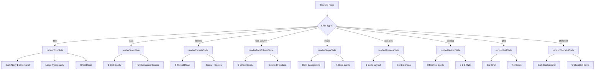

# Training Slides Update Implementation Plan

## Overview

This plan outlines the implementation required to update the training slides module with the new slide content and design specifications from `new-slide-content.md` and `presenter-dialog.md`.

**Key Principle:** The slide presentation module structure (navigation, progress tracking, keyboard controls, presenter notes toggle) will remain unchanged. Only the slide content, types, and rendering will be updated.

---

## Summary of Changes

### Current State
- 11 slides with simple bullet-point content
- Basic slide types: `title`, `content`, `completion`
- Simple two-column layout (illustration + bullet points)
- Generic presenter scripts

### Target State
- 12 slides with rich, varied layouts
- New slide types with specific layouts
- Design system with color tokens
- Detailed presenter dialogue from ACSC guidance

---

## New Slide Structure

| Slide | Type | Title | Layout Description |
|-------|------|-------|-------------------|
| 1 | title | Cybersecurity Made Simple | Dark navy background, large typography, shield icon |
| 2 | stats | Why Cybersecurity Matters to Us | 3 stat cards horizontal row + key message banner |
| 3 | threats | The 3 Biggest Threats | 3 horizontal threat rows with icons and quotes |
| 4 | two-column | How to Spot a Scam | Two equal columns with colored headers |
| 5 | steps | Something Looks Wrong | Dark slide, 5 vertical step cards horizontal |
| 6 | two-column | Passwords & MFA | Two columns with colored headers |
| 7 | updates | Keep Everything Updated | 3-zone layout with central visual anchor |
| 8 | backup | Backups - Your Safety Net | 3 cards showing 3-2-1 rule |
| 9 | two-column | Control Who Has Access | Two columns with icon and action items |
| 10 | two-column | Safe Email & Online Habits | DO THIS vs AVOID THIS columns |
| 11 | grid | Working from Home | 2x2 grid of tip cards |
| 12 | checklist | Your Action Checklist | Dark slide, 5 horizontal checklist rows |

---

## Implementation Steps

### Step 1: Update TypeScript Types

**File:** `types/training.ts`

Add new types to support the rich slide layouts:

```typescript
// Design system tokens
export type ColorToken = 'navy' | 'teal' | 'mint' | 'off-white' | 'light-gray' | 'mid-gray' | 'dark-text' | 'red' | 'amber' | 'green' | 'white';

// New slide type union
export type SlideType = 'title' | 'stats' | 'threats' | 'two-column' | 'steps' | 'updates' | 'backup' | 'grid' | 'checklist';

// Stat card for Slide 2
export interface StatCard {
  accentColor: ColorToken;
  stat: string;
  description: string;
}

// Threat row for Slide 3
export interface ThreatRow {
  accentColor: ColorToken;
  icon: string;
  title: string;
  description: string;
  exampleQuote: string;
}

// Column content for two-column slides
export interface ColumnContent {
  headerColor: ColorToken;
  headerIcon?: string;
  headerText: string;
  items: string[];
}

// Step card for Slide 5
export interface StepCard {
  color: ColorToken;
  icon: string;
  title: string;
  description: string;
}

// Backup card for Slide 8
export interface BackupCard {
  circleColor: ColorToken;
  number: string;
  label: string;
  description: string;
}

// Grid card for Slide 11
export interface GridCard {
  accentColor: ColorToken;
  title: string;
  bodyText: string;
}

// Checklist item for Slide 12
export interface ChecklistItem {
  title: string;
  detail: string;
}
```

Update slide interfaces to use these types.

### Step 2: Update Training Slides Data

**File:** `data/training-slides.ts`

Complete rewrite with new content structure:

1. **Slide 1 - Title Slide**
   - Dark navy background
   - Large typography with mint accent
   - Shield icon
   - Session info line

2. **Slide 2 - Stats Slide**
   - Three stat cards: $56,600 cost, 84,700+ reports, 14% increase
   - Key message banner about small business targeting

3. **Slide 3 - Threats Slide**
   - Three threat rows: Phishing, BEC, Ransomware
   - Each with icon, description, and example quote

4. **Slide 4 - Two-Column Slide**
   - Left: Suspicious Emails & Texts (red header)
   - Right: Suspicious Computer Behaviour (teal header)

5. **Slide 5 - Steps Slide**
   - Dark background
   - 5 step cards: STOP, Disconnect, Tell Someone, Call Bank, Report

6. **Slide 6 - Two-Column Slide**
   - Left: Strong Passwords (teal header)
   - Right: Multi-Factor Auth (mint header)

7. **Slide 7 - Updates Slide**
   - Left card: What needs updating
   - Center: Auto-update visual
   - Right card: Why it matters
   - Tip banner

8. **Slide 8 - Backup Slide**
   - Three cards: 3 copies, 2 types, 1 off-site
   - Warning banner about testing backups

9. **Slide 9 - Two-Column Slide**
   - Left: Least Privilege concept with shield icon
   - Right: Action items (navy header)

10. **Slide 10 - Two-Column Slide**
    - Left: DO THIS (green header)
    - Right: AVOID THIS (red header)

11. **Slide 11 - Grid Slide**
    - 2x2 grid: Secure Wi-Fi, Keep Separate, Use VPN, Lock Screen

12. **Slide 12 - Checklist Slide**
    - Dark background
    - 5 checklist items with mint check icons

### Step 3: Update Training Page Component

**File:** `app/training/page.tsx`

Add new render functions for each slide type:

1. **`renderTitleSlide`** - Update for new design
   - Dark navy background
   - Mint left accent bar
   - Large typography
   - Shield icon positioning

2. **`renderStatsSlide`** - New function
   - Three stat cards in horizontal row
   - Key message banner below

3. **`renderThreatsSlide`** - New function
   - Three threat rows with colored left bars
   - Icon circles, titles, descriptions
   - Quote boxes on right

4. **`renderTwoColumnSlide`** - New function
   - Two equal-width white cards
   - Colored header bars
   - Bullet lists

5. **`renderStepsSlide`** - New function
   - Dark background
   - Five step cards in row
   - Icon circles, step labels

6. **`renderUpdatesSlide`** - New function
   - Three-zone layout
   - Central visual anchor
   - Tip banner

7. **`renderBackupSlide`** - New function
   - Three cards with large numbers
   - 3-2-1 label
   - Warning banner

8. **`renderGridSlide`** - New function
   - 2x2 grid of tip cards
   - Colored left accent bars

9. **`renderChecklistSlide`** - New function
   - Dark background
   - Five checklist rows
   - Mint check icons

### Step 4: Add Design System Constants

Create color token mappings for Tailwind classes:

```typescript
const colorMap: Record<ColorToken, string> = {
  'navy': 'bg-[#0D1B2A] text-white',
  'teal': 'bg-[#028090] text-white',
  'mint': 'bg-[#02C39A] text-navy',
  'off-white': 'bg-[#F4F8FB]',
  'light-gray': 'bg-[#E8EFF5]',
  'mid-gray': 'text-[#8BA0B2]',
  'dark-text': 'text-[#1A2B3C]',
  'red': 'bg-[#D62839] text-white',
  'amber': 'bg-[#F4A261] text-white',
  'green': 'bg-[#2D9E6B] text-white',
  'white': 'bg-white text-dark-text',
};
```

---

## Design System Implementation

### Color Palette

| Token | Hex | Tailwind Class |
|-------|-----|----------------|
| navy | #0D1B2A | `bg-[#0D1B2A]` |
| teal | #028090 | `bg-[#028090]` |
| mint | #02C39A | `bg-[#02C39A]` |
| off-white | #F4F8FB | `bg-[#F4F8FB]` |
| light-gray | #E8EFF5 | `bg-[#E8EFF5]` |
| mid-gray | #8BA0B2 | `text-[#8BA0B2]` |
| dark-text | #1A2B3C | `text-[#1A2B3C]` |
| red | #D62839 | `bg-[#D62839]` |
| amber | #F4A261 | `bg-[#F4A261]` |
| green | #2D9E6B | `bg-[#2D9E6B]` |

### Recurring Elements

1. **Left Accent Bar**
   - 22px wide, full height
   - Teal or mint color
   - Present on all content slides

2. **Footer Strip**
   - 38px tall, full width
   - Navy or darker navy
   - ACSC attribution left, slide number right

3. **White Content Cards**
   - Rounded corners
   - Soft drop shadow
   - Optional colored top-edge accent

4. **Icon Circles**
   - Filled circles in accent colors
   - White icons inside
   - Used for threats, steps, checklists

---

## Presenter Notes Integration

Each slide should include the presenter dialogue from `presenter-dialog.md`:

- Slide 1: ~45 seconds intro
- Slide 2: ~2 minutes on why it matters
- Slide 3: ~3 minutes on threats
- Slide 4: ~2 minutes on spotting scams
- Slide 5: ~2 minutes on emergency steps
- Slide 6: ~2.5 minutes on passwords/MFA
- Slide 7: ~1.5 minutes on updates
- Slide 8: ~2 minutes on backups
- Slide 9: ~1.5 minutes on access control
- Slide 10: ~1.5 minutes on safe habits
- Slide 11: ~1.5 minutes on working from home
- Slide 12: ~1.5 minutes on action checklist

---

## Mobile Responsiveness

Per the specification:

- Two-column layouts should stack vertically on mobile
- 5-step row (Slide 5) should scroll horizontally or stack 2-3 per row
- 2x2 grid (Slide 11) should stack on phones
- All text should remain readable at mobile sizes

---

## Accessibility Requirements

- All colored header bars must have sufficient contrast
- Icon circles need `aria-label` attributes
- Keyboard navigation already implemented
- Screen reader friendly content structure

---

## Files to Modify

| File | Changes |
|------|---------|
| `types/training.ts` | Add new types for slide layouts |
| `data/training-slides.ts` | Complete rewrite with new content |
| `app/training/page.tsx` | Add new render functions for slide types |

---

## Mermaid Diagram: Slide Type Flow



---

## Next Steps

1. Switch to Code mode to implement the changes
2. Update types first to establish the data structure
3. Update training-slides.ts with new content
4. Update training page with new render functions
5. Test all 12 slides for correct rendering
6. Verify mobile responsiveness
